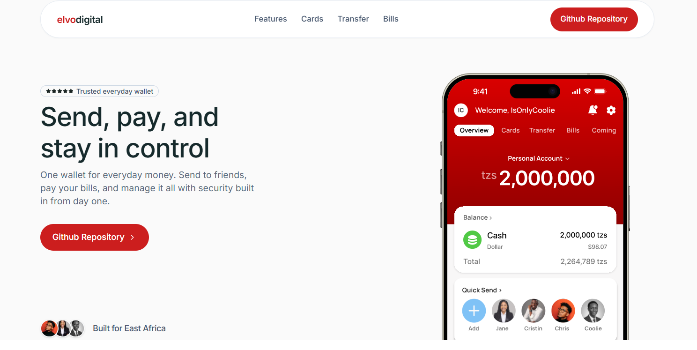

# ELVO Digital Landing Page

Marketing site for **ELVO Digital**, a trusted digital wallet and payments platform built for everyday money in East Africa. Send, pay bills, and stay in control, with security and clarity at every step.

<p align="center">
  
</p>

---

## Overview

This repository contains the public-facing landing page for ELVO. It presents the product vision, core capabilities, and roadmap in a modern, responsive layout, alongside the backend platform in the [main monorepo](https://github.com/isonlycoolie/elvo-kidigital).

The page is optimized for clarity and trust: wallet transfers, bill payments, security controls, and upcoming features (agents, family accounts, delegated access) are explained in plain language without over-promising capabilities still in beta.

---

## Documentation

Platform docs live in the monorepo [`docs/`](../docs/) folder:

| Resource | Description |
|----------|-------------|
| [docs/README.md](../docs/README.md) | Documentation index with landing preview |
| [docs/INTEGRATION-CONTRACTS.md](../docs/INTEGRATION-CONTRACTS.md) | Cross-service API integration contract |
| [docs/landing-hero.png](../docs/landing-hero.png) | Hero section screenshot |

---

## Highlights

| Area | What visitors see |
|------|-------------------|
| **Hero** | Product positioning, trust badge, and app preview |
| **Features** | Unified bill pay, lookup-before-pay, built-in security |
| **Wallet flows** | Transfer and bills payment showcases |
| **Trust** | Security layer, cards (waitlist), and everyday wallet story |
| **FAQ** | Honest answers on wallet, bills, security, and roadmap |
| **Open source** | Link to the platform repository for contributors |

---

## Tech stack

- **[Next.js 16](https://nextjs.org/)** (App Router)
- **[React 19](https://react.dev/)** + **TypeScript**
- **[Tailwind CSS 4](https://tailwindcss.com/)**
- **[Framer Motion](https://www.framer.com/motion/)** for scroll and entrance animations
- **[Lucide React](https://lucide.dev/)** icons
- Centralized copy in [`src/content/site-copy.ts`](./src/content/site-copy.ts)

---

## Getting started

### Prerequisites

- Node.js 20+
- npm, yarn, pnpm, or bun

### Install and run

```bash
cd landingpage
npm install
npm run dev
```

Open [http://localhost:3000](http://localhost:3000) in your browser.

### Production build

```bash
npm run build
npm start
```

### Lint

```bash
npm run lint
```

---

## Project structure

```
landingpage/
├── public/                          # Static assets (Next.js requirement)
├── src/
│   ├── app/                         # Next.js App Router (layout, page, globals)
│   ├── assets/                      # Imported images, fonts, icons
│   ├── components/                  # Shared, non-feature UI
│   │   ├── layout/                  # Header, Footer
│   │   ├── motion/                  # Reveal, HeroEntrance
│   │   └── ui/                      # Button, BentoChip
│   ├── shared/
│   │   └── feature-banner/          # FeatureBannerContent, Phone, styles
│   ├── features/                    # One module per landing section
│   │   ├── index.ts                 # Barrel export for page imports
│   │   ├── hero/
│   │   ├── everyday-wallet/
│   │   ├── product-features/
│   │   ├── cards/
│   │   ├── transfer/
│   │   ├── bills/
│   │   ├── coming-soon/
│   │   ├── trusted-advantage/
│   │   ├── founder-quote/
│   │   ├── secured-vc/
│   │   ├── faq/
│   │   └── contribution/
│   ├── content/
│   │   ├── site-copy.ts             # All landing page copy (single source of truth)
│   │   └── normalize-copy.ts        # Punctuation normalization for copy
│   ├── lib/                         # Links, scroll helpers, utilities
│   ├── providers/
│   ├── contexts/
│   ├── hooks/
│   ├── constants/
│   └── types/
├── package.json
├── tsconfig.json                    # @/* → ./src/*
└── next.config.ts
```

Import aliases use `@/*` mapped to `./src/*` (e.g. `@/features`, `@/shared/feature-banner`).

---

## Editing copy

All user-facing text lives in [`src/content/site-copy.ts`](./src/content/site-copy.ts). Update strings there rather than hardcoding copy in components.

---

## Related documentation

- [Documentation index](../docs/README.md)
- [API integration contract](../docs/INTEGRATION-CONTRACTS.md)
- [Main ELVO Digital repository](https://github.com/isonlycoolie/elvo-kidigital)

---

## License

Private project. All rights reserved unless otherwise stated by the repository owner.
